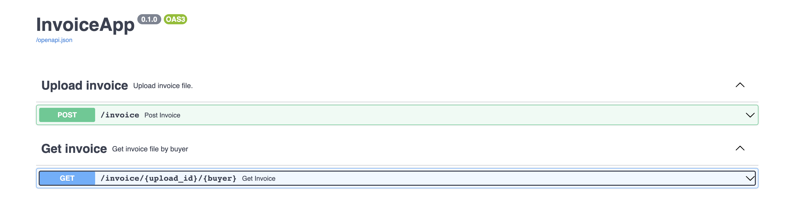
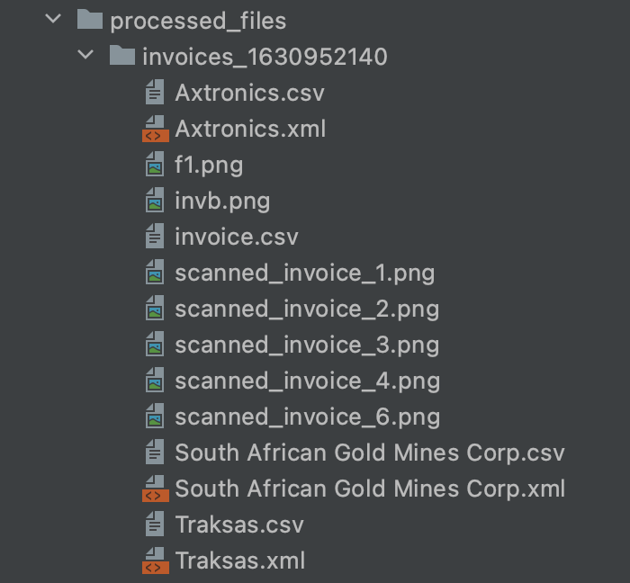

# Invoice server
**Invoice-server** is a task that solves the following problem.

We need to write a system that parses and ingests the given (large) file and has the ability to
produce the two different output formats specified below.
As a user of that system I need to be able to configure or otherwise specify which of the two
output formats should be produced.
The new output formats will then later on be ingested by other systems - the integrity of data and
files has to stay. The later ingestion of the newly produced files is not part of this exercise.
The two destination formats should be:
1. CSV file of the original data but split up by 'buyer'. So if there are 10 different buyers overall
there should be 10 different output files. The rest of the data in the CSV should be arranged in
the same way as in the input file.
2. XML file of the original data split up by 'buyer'. The invoice image should not be part of the
XML data but the single invoice files should be extracted from the CSV and be placed into the file-system. The format of the XML should loosely follow the input CSV in regards to node-
names etc.You can decide any changes to folder-structure etc. of the output format.

## Implementation
The task is implemented with python using [FAST API](https://fastapi.tiangolo.com/).
The API is based on (and fully compatible with) the open standards for APIs: [OpenAPI](https://github.com/OAI/OpenAPI-Specification)

The pandas library is used for easy analysis of csv files. [pandas](https://pandas.pydata.org/docs/index.html) is an open source, BSD-licensed library providing high-performance, easy-to-use data structures and data analysis tools for the Python programming language.


## Deployment process
To build the docker container run:
```
docker build -t invoice-server .
```
After that you can run it by:
```
docker run -d --name invoice-server-container -p 80:80 invoice-server
```
## Using the API
The base path of the API is http://127.0.0.1/docs - if go to this page you will see the exposed API


- `POST /invoice` - uploads csv invoice and generates csv and xml based on buyer  - returns unique upload id
- `GET /invoice/{upload_id}/{buyer}` - returns  csv or xml file based on target type (csv or xml as query param) and upload id

## Troubleshooting
Get the id of the running container:
```
docker ps
```
Interactive mode, get access to a command prompt in a running container:
```
docker exec -it <container_id> sh
```
Go to `/app/processed_files/` - see generated files and images <br />



## API and Unit Testing
To run the tests:
1. install pytest with `pip install pytest`
2. Go to `test` dir and execute `pytest` (It will detect the files and tests automatically, execute them, and report the results back to you)
    
- test_main.py is an api test.
- test_process_invoice_file.py and test_upload_invoice_file.py are unit tests. <br />


## TODO 
Here is a list of some items that could be further improved / added:
- I managed to upload a 3GB file. However, the library does have some limits and when dealing with big data files (more than 20GB) the recommended way to process them is in chunks.
- File processing could be triggered by a queue. This way we could have control over the number of files being processed and re-try processing if needed
- File format validation could be added
- Improve error handling
- Increase test coverage  
- The test process should be an idempotent operation - delete the files after test process